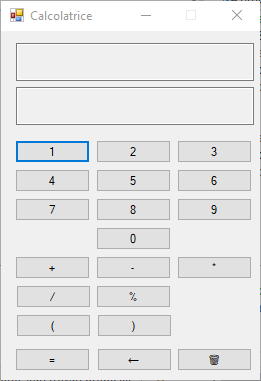

# Calcolatrice Semplice

## Descrizione
Una calcolatrice semplice implementata in Visual Basic per eseguire operazioni di base come addizione, sottrazione, moltiplicazione e divisione. Include anche funzionalità aggiuntive come calcolo del percentuale e radice quadrata.

## Utilizzo
1. Avviare l'applicazione.
2. Digitare i numeri e selezionare l'operazione desiderata tramite i pulsanti.
3. Premere il pulsante "=" per ottenere il risultato dell'operazione.
4. È possibile utilizzare anche la radice quadrata e le parentesi tonde.

## Funzionalità
- Addizione
- Sottrazione
- Moltiplicazione
- Divisione
- Percentuale
- Parentesi tonde

## Tecnologie Utilizzate
- Visual Basic .NET

## Screenshot

## Licenza
Questo progetto è sotto licenza [MIT](LICENSE).

---

# Simple Calculator

## Description
A simple calculator implemented in Visual Basic to perform basic operations like addition, subtraction, multiplication, and division. It also includes additional features like percentage calculation and square root.

## Usage
1. Launch the application.
2. Enter numbers and select the desired operation using the buttons.
3. Press the "=" button to get the result of the operation.
4. You can also use square root and parentheses.

## Features
- Addition
- Subtraction
- Multiplication
- Division
- Percentage
- Parentheses

## Technologies Used
- Visual Basic .NET

## Screenshot

## License
This project is licensed under the [MIT License](LICENSE).
